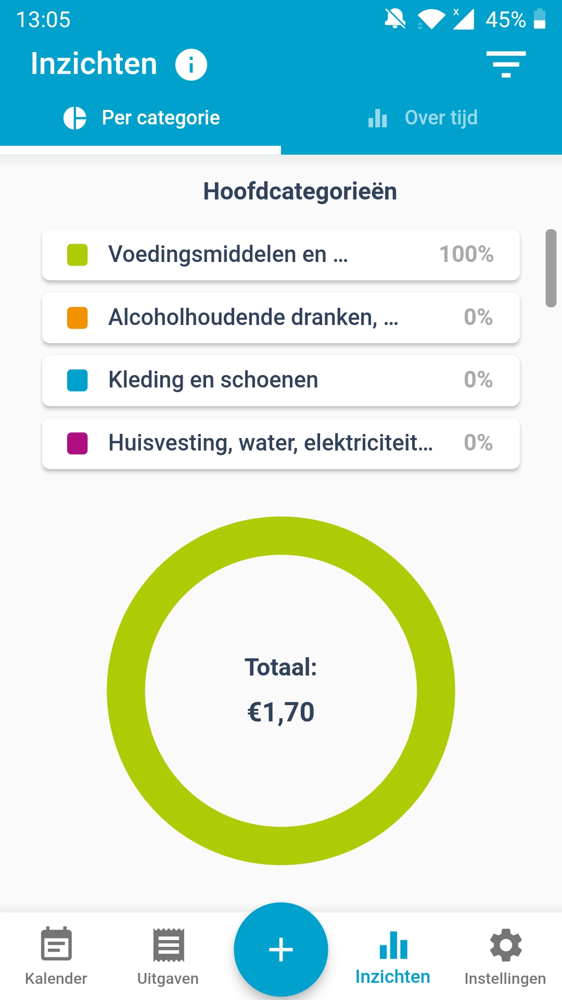
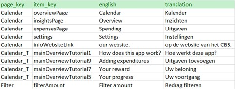

```{r setup, include=FALSE}
knitr::opts_chunk$set(echo = FALSE)
```

## Overview

- Introduction
- The sample
- The data
- Creating respondent profiles
- Deriving behaviour indicators
- Linking the indicators to the respondent profiles
- Linking the best indicators to background characteristics and personalized feedback

## Introduction

- Challenges for traditional surveys
- Increased administration of web surveys
- Rise in mobile device use
- More paradata can be collected
- No research into the influence of personalized feedback on overall app-interaction
- Few literature on relationship between background characteristics and overall app-interaction

## Research question

"How do personalized feedback and background characteristics influence the user app interaction?"

## The sample {.columns-2}

- Households sampled from national registers
- N = 1600 in the Netherlands
- N = 1600 in Luxembourg
- N = 800 in Spain
- Recruitment in two waves
- Household Budget Survey (HBS) app
- Study period of two weeks
- Experimental condition

<center>
  {width=50%}</br>
  <caption>Figure 1: The insights page</caption>
</center>

## The data {.columns-2}

- Paradata for 328 participants generated
- Records pages visited, buttons clicked etc.
- Timestamps are also logged

<center>
{width=100%}</br>
<caption>Figure 2: Snippet of logged events in the HBS app</caption>
</center>

## Creating the respondent profiles

- Indicators of measurement error
  - Data variability
  - Data quantity
- Derive proxy features for these indicators
  - Mean variance in bought products
  - Mean variance in purchases
  - \# unique purchases
- Create a data frame with the values of these proxies
- Cluster participants based on these values
- Assign cluster label as respondent profile

## Deriving the behaviour indicators

- From the paradata, I derive the following behaviour indicators:
  - \# interrupted tutorials
  - \# consulted tutorials
  - \# days logged in
  - \# manual entries
  - Average event latency
  
## Linking the indicators to the respondent profiles

- Divide data into training and test set
- Then execute the following steps:
  1. Add a behaviour indicator to the current set of predictors
  2. Train SML algorithms (kNN, SVM, RF, NB)
  3. Calculate F1-score and Matthew's Correlation Coefficient
  4. If the average MCC score has significantly increased, retain the newly added indicator
  5. Repeat steps 1-4 until no more indicators can be added.
  
## Linking the best indicators to background characteristics and personalized feedback

- Multivariate multiple regression for background characteristics
  - Background characteristics are predictors
  - Behaviour indicators are outcome
  
- Multivariate simple regression for personalized feedback
  - Personalized feedback is predictor
  - Behaviour indicators are outcome
  
- Regression coefficient give first indication

## Questions?

Thank you very much for your time and attention. Are there any questions left?